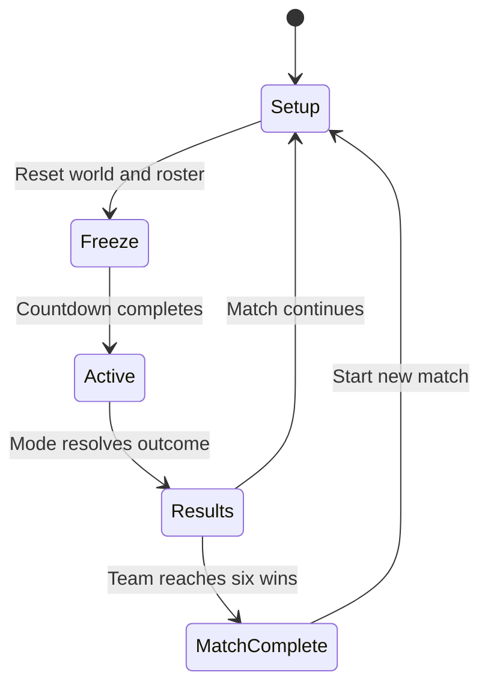

# SOCOM successor game design

Draft 1 — October 2, 2026. This is an implementation proposal for the existing Godot project, informed by [historical research](RESEARCH.md). It defines an original PS2-style tactical third-person shooter, initially playable offline and eventually built around 5v5 single-life rounds. SOCOM II is the provisional mechanical reference, while the five supplied images guide atmosphere and presentation.

**First deliverable:** a controllable soldier moving through one original town graybox, with a stable camera, useful stances, clear routes, and a movement test course. All numerical values below are proposed starting points, not recovered SOCOM values.

**Implementation update — October 3, 2026:** the first local prototype now includes Old Quarter, the Movement Lab, a controllable soldier, stance/camera clearance, a tuning menu, and a limited practice rifle. See [playtest notes](PLAYTEST.md) for controls, current scope, and validation limits. The combat, round, objective, and networking systems described below remain the intended roadmap; this document is not a claim that every feature is implemented.

**Handling revision:** directional hip/torso turns, constrained knees, weighted acceleration/braking and landing compression, a finite-ammunition pistol/rifle pair, controller-only menus, and separate recoil tuning per weapon are now implemented. The values later in this draft remain design proposals where they differ; [PLAYTEST.md](PLAYTEST.md) records the current build's defaults.

## Experience and scope

The player leaves a sheltered spawn, chooses a route, reads a corner from third person, changes stance behind a low wall, and crosses an exposed street to reach a better position. In the eventual game, a short exchange can remove a teammate for the rest of the round. The remaining players must use what they know about routes, sounds, and objectives to finish the job. Eliminated players watch their teammates and prepare for the next round.

The design should preserve five qualities:

1. **The soldier occupies space.** Body stance, weapon position, camera clearance, and cover agree.
2. **Information has value.** A view around a corner, a footstep, or a concise callout changes a decision.
3. **Movement stays responsive.** Tactical choices come from exposure and consequences; controls should respond promptly.
4. **Routes can be learned.** Named landmarks and recognizable intersections support repeated rounds and adaptation.
5. **One life creates a shared story.** Death leads to teammate spectating and then a clean new round.

The historical games supported up to 8v8; 5v5 is our chosen adaptation. Classic Demolition's shared bomb differs from an attacker-only bomb mode. The [research findings](RESEARCH.md#historical-objective-modes) explain these distinctions with sources.

### Milestone boundaries

| Stage | Player experience | Content boundary |
| --- | --- | --- |
| M0 — Traversal | Explore a compact town, change stance, jump, lean, and navigate stairs and cover. | One local player, one movement course, one graybox, minimal HUD. |
| M1 — Combat feel | Fire and reload a rifle, engage static and moving targets, test muzzle obstruction. | One rifle, hitboxes, health, death, sound, debug tools. |
| M2 — Round loop | Play short offline elimination rounds and watch a surviving ally after death. | Simple bots and a complete round lifecycle. |
| M3 — Objectives | Contest a shared bomb; later escort hostages through a map variant. | Demolition first, Extraction second. |
| M4 — Network validation | Play the established loop across two clients, then ten participants. | Authoritative simulation, prediction, reconciliation, interpolation, disconnect handling. |
| M5 — Nostalgia slice | Experience one coherent map with final-style character, environment, sound, and HUD. | Art polish and usability after the gameplay gates pass. |

An early visual sample can run alongside M1, but full art production follows proven dimensions. Campaign squad commands, vehicles, swimming, destructible buildings, progression, a weapon economy, matchmaking, clans, and voice infrastructure are outside M0–M3. Breach and Escort are possible later modes. Modern mobility such as slides and tactical sprint is excluded from the baseline.

## Movement and controls

Use camera-relative directional movement with shooter orientation: horizontal look turns the aim direction; forward follows that direction; sideways movement strafes; backward movement backpedals. Keep the torso and weapon visibly aligned with aim while the legs represent movement direction. Do not rotate the whole character to face sideways whenever the player strafes.

The keyboard and gamepad are both supported. Keyboard controls are the first implementation path. Controller sensitivity, dead zone, inversion, and remapping need to exist before judging whether controller play feels right. Do not reproduce PS2 pressure-sensitive button requirements.

| Action | Keyboard and mouse proposal | Gamepad proposal |
| --- | --- | --- |
| Move / look | WASD / mouse | Left stick / right stick |
| Slow walk | Hold Shift | Partial left-stick deflection |
| Crouch / stand | Tap C | Tap east face button |
| Prone / stand | Hold C or press Z | Hold east face button |
| Forward dive to prone | Hold C while running forward | Hold east face button while running forward |
| Jump | Space | South face button |
| Lean left / right | Hold Q / E | Hold LB / RB |
| Fire / focus aim | Left / right mouse | RT / LT |
| Reload | R | West face button |
| Interact | F | North face button |
| Switch weapon | 1 / 2 | D-pad left / right |
| Change fire mode | B | D-pad down |
| Optional first person later | V | D-pad up |
| Scoreboard / pause | Tab / Escape | View / Menu |
| Spectate previous / next | Q / E when eliminated | LB / RB when eliminated |

Tap/hold stance inputs must not trigger both actions. Interact/reload/weapon bindings are reserved in M0 and become active with their systems. Equipment selection and push-to-talk receive bindings when introduced, rather than overloading the initial controller scheme.

### Movement values

Speeds are the original game's, read from its motion table (`motion.rdr`: each gait's top speed and the bands its clips play in) at 0.1 m to the source unit. The recovered gait clips are rate-matched to the body's actual speed, so these can be retuned without the feet sliding.

| Parameter | Value | Purpose |
| --- | --- | --- |
| Standing run | 6.5 m/s | Ordinary travel speed; no separate sprint. |
| Slow walk | 2.6 m/s | What half a push of the original's stick gave; the original had no walk button. |
| Crouch movement | 1.48 m/s | A deliberate crouch walk behind cover. |
| Prone crawl | 1.1 m/s | Low crawl, forward or back; sideways is half as fast. |
| Strafe / backward multiplier | 1.0 / 0.57 standing, 1.0 / 0.91 crouched, 0.5 / 1.0 prone | The original ran 6.5 m/s sideways and 3.7 backwards. |
| Ground acceleration / braking | 32 / 35 m/s² | The original reached nine tenths of its run in 0.18 s. It stopped at once; braking keeps a short settle. |
| Jump apex / gravity | 0.65 m / 18 m/s² | Small purposeful jumps; derive launch speed from these. |
| Jump rules | Grounded only; 0.25 s minimum between takeoffs | No speed gain from repeated jumping. |
| Stand / crouch body height | 1.80 / 1.15 m | Establish cover and door dimensions. |
| Body radius | 0.32 m | Test narrow passages consistently. |
| Prone envelope | Approximately 1.8 m long, 0.65 m wide, 0.55 m high | Validate turning and transitions against walls. |
| Stance transitions | 0.18 s crouch, 0.40 s prone | Noticeable but responsive commitment. |
| Maximum walkable slope | 45° | Reject steep walls as floor. |

Normalize diagonal input. Start with no stamina meter and no automated cover attachment. Crouching or going prone must produce a meaningful reduction in exposed silhouette; making the camera lower without changing the body is insufficient.

Before enlarging a stance collider, test the destination volume. If blocked, remain in the current stance and show a brief obstruction indication. Preserve foot position across transitions. Prone requires a volume that accounts for body length and turning; a short upright capsule alone would let the visible body rotate through walls. M0 may use a simple visible proxy, but must validate that envelope before permitting prone-only spaces.

Use simple ramps beneath visible stair meshes initially. Add genuine step traversal only if required by the later collision kit. Holding crouch for 0.35 seconds while running forward launches a committed dive: 5.6 m/s forward speed, 3 m/s upward velocity, collision against the world, and a prone landing with 0.45 seconds of recovery. Fire and reload are locked during the dive and recovery. Check the prone envelope before launching. Ledge grabs and ladder climbing remain follow-ups.

## Third-person camera and aiming

Use an elevated, centered trailing camera with the soldier's head in the lower third of the frame, leaving the central aim point clear. This framing follows the supplied 4:3 gameplay references. Fixed shoulder switching is not part of M0; it changes available information and needs a deliberate balance decision.

| Parameter | Starting value |
| --- | --- |
| Vertical FOV | 60°, adjustable 50–75° |
| Standing pivot | 2.30 m above ground in open space |
| Crouch / prone pivot | 1.80 / 1.30 m above ground; ceiling clearance can lower these |
| Trailing distance | 3.0 m, tune within 2.5–3.5 m |
| Horizontal offset | 0.0 m; centered behind the player |
| Pitch range | Approximately 65° upward and 50° downward |
| Focus aim | 50° vertical FOV and 2.3 m distance |
| Lean | Up to 0.25 m lateral displacement, reduced by obstruction |

Vertical FOV is specified to avoid aspect-ratio ambiguity. The world and HUD use a fixed 4:3 presentation, with equal black side bars on wider displays. Mouse rotation has no acceleration or heavy smoothing by default; gamepad has a tunable response curve. Camera position may ease when returning from an obstruction, but it must retract promptly when a wall intervenes. Sweep from the stance eye to the elevated pivot so low ceilings cannot be bypassed. Match stance changes smoothly without delaying input or making the aim wander.

The camera must collide with world geometry and exclude its owning body. Check both the trailing arm and any lateral pivot displacement: a spring arm alone does not establish that a lean origin is clear. Fade the local mesh when the camera gets too close. Prevent seeing through roofs, underside faces, and thin walls. Ordinary third-person visibility around an edge is part of this proposal; exposing enemy outlines through solids is not.

### Reticle and muzzle agreement

M0 can display a debug aim ray without weapon damage. M1 must use this sequence:

1. Cast from the camera through the reticle to establish an aim point, capped at weapon range.
2. Establish an unobstructed weapon origin relative to the character; detect a muzzle pushed inside or beyond nearby cover.
3. Cast from that valid origin toward the aim point. The first obstruction determines the hit.
4. Show a blocked-fire cue when the camera sees a target that the weapon cannot reach. Effects and damage use the same result.

A target visible above a crate must not take damage if the muzzle is below the crate's edge. Lean moves the relevant weapon and exposure volumes along with the visual pose. The reticle has a fixed-size, semi-transparent charcoal circle and pale center dot. Its aim point stays dead center until recoil lifts it; the real hitscan ray projects to that raised point. The camera follows 35% of vertical kick, with the remaining 65% visible as reticle climb. Four independent cardinal marks move outward with actual angular spread and ease inward as accuracy recovers. Optional first-person and scope views reuse the same weapon simulation later.

## Combat for M1

Start with one fictional general-purpose rifle. Give both teams the same weapon while testing fundamentals. Historical weapon variety is useful research, but a large weapon list would multiply balancing work before the controller feels right.

| Property | Proposal |
| --- | --- |
| Firing model | Instant hitscan with persistent surface impact decals; optional cosmetic tracers |
| Magazine / reserve | 30 loaded, 90 reserve rounds |
| Modes | Semi-automatic and automatic |
| Automatic rate | 600 rounds/minute |
| Reload | 2.4 seconds; firing locked during reload |
| Health | 100, no regeneration, no revive |
| Damage within test range | 34 torso, 100 head, 25 limb |
| Test ranges | 10, 25, and 50 m; defer damage falloff |
| Accuracy | Rifle cone half-angle: 0.25° stationary, 1.1° walking, 5.75° running; sustained running fire reaches 9.25° |
| Stance adjustment | Crouch ×0.8, prone ×0.5 to total spread and recoil; focus aim adds ×0.75 |
| Recoil | Rifle climbs 0.65° per standing shot, capped at 8°; bloom grows 0.35° per shot, capped at 3.5°. Full running adds ×1.25 kick and ×2.8 bloom growth. |

Three torso hits at 600 RPM imply 0.20 seconds between first and lethal third hit when every shot lands. That is a weapon-system test value, not a promise about real encounter duration or original SOCOM lethality. Avoid long damage exchanges, but tune against actual target acquisition and movement.

Use a pooled reserve initially. Partial-magazine persistence is a future fidelity experiment because the historical behavior was not adequately verified. Reload cancellation keeps current ammunition until a defined completion event; never refill and then refund reserve on interruption. One hit should resolve to one damage region. Death disables movement, firing, and interaction immediately.

Add one grenade only after rifle behavior is stable: first a simple frag with readable throw, fuse, line-of-sight-aware blast damage, and self/team damage. Smoke follows when it can reliably obscure players across relevant render settings. Limit initial quantity to one frag per player to test displacement without making spawn-to-contact routes depend on opening grenade saturation. This quantity is a proposed adaptation. No weapon economy, attachment progression, automatic enemy radar pings, killstreaks, or unlock advantages.

## Round and objective specification

The following are our complete baseline decisions where historical sources leave ambiguity. Keep them in a data resource so they can change without rewriting level scripts.

### Shared round rules

Two teams of five slots; no mid-round respawn or revive. Offline bot count is adjustable. Late joins wait for the next round. Start with 5 seconds of freeze/setup, 5 minutes active time, and 6 seconds for results. First to six round wins takes the match; draws award no point and replay the round. Alternate spawn assignments after each resolved round; Extraction also alternates attacker role. These are proposed fairness rules, not claims about historical side switching.

Friendly fire is enabled for round testing and disabled in the free-roam target range. Freeze time allows looking but blocks movement, fire, and objective interaction. Pause stops the offline simulation; later network matches continue while a local menu is open.

Elimination is a player state within an active round, not a pause of the round state machine. Resolve queued events once per simulation tick. Apply damage and deaths, then validate surviving actors' interactions, then resolve objective completions, then elimination and timeout. An interaction finishing exactly on its deadline is accepted if its actor is still eligible. A planted bomb's completed defuse takes precedence over detonation on the same tick. Record the outcome reason once.

### Mode outcomes

| Mode | Objective win | Elimination and timeout | Special cases |
| --- | --- | --- | --- |
| Suppression | No separate objective. | Sole surviving team wins. At time expiry, higher living-player count wins; equal counts draw. | Both teams eliminated in one tick draw. Health totals do not break ties. |
| Demolition | Detonate the shared bomb at the enemy base. | Before planting, elimination resolves normally; unplanted timeout draws. | While planted, the fuse governs overtime. Eliminating the planting team does not cancel the bomb. |
| Extraction | Attackers extract two of three hostages. | Attacker elimination or unfulfilled timeout gives defenders the win; defender elimination gives attackers the win. | Hostage penalty and simultaneous outcomes are defined below. |

Demolition bomb states are `AtCenter → Carried → Dropped/Planting → Planted → Defused/Detonated`. Either team may collect a center or dropped bomb. Only one carrier exists. Plant only at the opposing base; require an uninterrupted 5-second hold within a 1.5 m interaction radius. Release, departure, or death cancels and resets progress. The planted fuse lasts 35 seconds. Defuse requires an uninterrupted 7-second hold by the threatened team and returns the bomb to a recoverable dropped state at the site. If regular time has already expired, a successful defuse awards the threatened team the win. Otherwise play resumes.

While a bomb is planted, destroying all defenders awards the planting team victory; if all planters are eliminated, surviving defenders must still defuse. If both teams are eliminated while it is planted, the fuse continues and the planting team wins on detonation. These deliberately specified edge cases must be tested. A dropped bomb leaving playable bounds returns to its last valid ground position, or the center marker if none exists.

Extraction is a later map variant. Hostages use Follow/Hold commands and must physically reach the extraction volume alive; crossing a wall or touching the zone from outside does not count. A defender killing a hostage grants attackers one rescue credit; an attacker killing one permanently removes it from the rescuable pool. If fewer than two total rescue credits remain achievable, defenders win. Already rescued hostages cannot be harmed or counted again. Resolve earned rescue success before elimination; if neither objective success nor impossibility resolves the tick, simultaneous team elimination draws. At timeout, an achieved rescue wins; otherwise defenders win.

The simplified hostage penalty is our explicit implementation rule. Verify the original's full penalty handling before claiming exact fidelity. AI follows reachable paths, stops and signals when blocked, and remains in-world when its escort dies. No teleportation through geometry to finish an objective.

### Spectating and round reset

On elimination, show a short death transition, then attach to a living teammate. Cycle teammates only; no enemy-follow or free camera in the competitive preset. If nobody remains, show a neutral round-status view without revealing opponents, including during bomb overtime. Clearly label the watched player and show their weapon information only while spectating them. No killcam revealing an unseen enemy's location.

Future in-game voice separates living and eliminated teammates during active rounds and reunites them between rounds. Team callouts and a speaking indicator are sufficient for the first voice implementation; recreation of every original radio channel can wait.

Reset must restore players, health, ammunition, stance, equipment, objectives, bots, spawned effects, timers, UI, and random seed state. It must also clear pending interactions and prior-round events. Stable round IDs allow stale events to be rejected.

## First map Old Quarter

Old Quarter is an original fictional coastal town at late afternoon. It uses the spatial vocabulary of the references: plaster facades, stone pavement, a market courtyard, an arch, exterior stairs, and a sheltered service passage. The [wireframe](wireframes.svg) is a connectivity and composition proposal, not a recreation of an existing SOCOM map or a measured floor plan.

Initial envelope: approximately **112 m east–west by 96 m north–south**, excluding scenery. Five west spawn markers and five east spawn markers sit near opposing ends. Begin with Suppression; add Demolition markers after the routes work. Extraction uses a separately tested variant with an eastern hostage house and western extraction area.

| Area | Gameplay purpose | Graybox requirements |
| --- | --- | --- |
| West Yard / East Yard | Orient and distribute the teams. | Two usable exits each, five spaced spawn slots, opaque protection from enemy spawn. |
| Market | Central contested space and eventual shared bomb location. | Roughly 22 × 18 m, staggered stalls, no all-seeing center perch. |
| Arch | A memorable entrance to the central route. | Approximately 4 m clear width, sufficient camera clearance, offset approach to break spawn sightline. |
| Courtyard | Covered northern rotation. | A cross-link to Market and an alternate exit toward East Yard. |
| Balcony | Limited high ground above the north edge of Market. | Approximately 3.2 m elevation, two approaches, view of part of Market only. |
| Service Passage | Southern route favoring close movement. | Roughly 2.4–3 m clear width, bends, a covered section, cross-link to Market. |
| Stair House | Camera and stance test within the actual level. | One traversable interior room, a 1.8 m wide stair, two doors, no decorative dead-end maze. |

Use a loose center/north/south network with cross-links, not three sealed lanes. Keep no more than two fighting elevations initially. Each strong position must have a second approach or a practical way to displace its occupant. Distinct landmarks should allow a new player to follow “Arch to Market, then Balcony” without a minimap arrow.

Target first contact on the direct route after roughly 12–17 seconds at default run speed; target slower outer approaches around 18–23 seconds. These correspond approximately to 55–75 m and 80–105 m routes, including bends. Measure actual traversal, because diagonal shortcuts and stairs will alter them. Initially aim for most firing opportunities at 8–35 m, with a few deliberate 40–60 m views. Avoid visible spawn-to-spawn lines and a balcony that covers every exit.

Use 0.5 m placement increments, 0.9–1.1 m low cover, approximately 2.2 m full visual cover, ordinary door clearances of at least 1.2 × 2.2 m, and enough space above stairs for both body and camera. Provide a 1 m ruler prop and stance silhouettes. Start broad and shorten exposed crossings only after traversal and combat measurements.

## PS2 visual and audio direction

Use original assets and a distinct eventual public identity; SOCOM remains the internal reference. Start with olive, stone, sand, faded wood, and restrained warm sky color. Readable material groups and silhouettes should establish the town before surface detail.

Proposed asset budgets: a 2,000–4,000 triangle soldier, a 300–800 triangle weapon, 100–600 triangle common props, mostly 128–256 px tiling textures, and selective 512 px character sheets. These are working production limits, not historical specifications. Use simple diffuse materials, modest specularity, restrained shadows, a sky backdrop, and distance haze. Keep collision simpler than the visible meshes.

Render the whole game, including HUD and menus, at a fixed 640 × 480. Scale that 4:3 frame uniformly to fit each window, with black bars filling unused space. Every monitor shows the same world, field of view, image detail, and HUD proportions; larger displays only enlarge the image. PS1-style vertex wobble, extreme affine distortion, and heavy CRT effects are not default requirements for this PS2 target. Preserve a 60 FPS control and rendering target on the development machine; nostalgia does not require input lag.

The character needs recognizable stance silhouettes, a held rifle, directional locomotion, and a restrained transition into prone. A rigged final character can replace a procedural proxy after the camera is accepted. Avoid animation-driven movement in the first controller so animation iteration does not change route timing.

Audio begins early: spatial footsteps on stone and dirt, a distinct rifle report, reload cues, impacts, and quiet environmental ambience. Give nearby movement useful directionality. Use modest distance attenuation and later simple occlusion tests; verify cues through headphones and speakers. Radio filtering should preserve speech intelligibility. Music belongs mainly in menus and transitions during competitive play. This is a proposed mix, not a reconstruction of the original soundtrack.

## Interface wireframe

The [HUD wireframe](wireframes.svg) shows the intended information hierarchy. M0 displays a reticle, stance, control hints, location, and an optional movement/camera debug panel. Weapon and round panels appear only when those systems exist.

For rounds: timer and round score at top center; compact compass/location at top right; ammunition and weapon bottom left; team alive status bottom right; interaction prompt near the reticle only when relevant. Indicate teammates with names or symbols that do not rely on color alone. An optional small tactical map shows permitted friendly/objective information; no omniscient enemy dots.

Use compact translucent panels and restrained typography. Keep text readable within the fixed 640 × 480 frame, preserve HUD proportions across displays, and use at least 5% edge-safe margins. Results explain why the round ended. Spectator mode is visually explicit. A future lobby prioritizes map, mode, rules, roster, loadout, and Ready; no shop or progression screen intervenes in the play loop.

## How we judge success

M0 succeeds when a player can identify and traverse all three routes, intentionally use low cover, change stance without clipping, and navigate the interior and balcony without fighting the camera. M1 succeeds when aiming and hit feedback are trustworthy at cover edges and movement still feels responsive. M2 succeeds when death, teammate watching, outcome resolution, and reset form a coherent uninterrupted loop.

Record route times, camera failures, stance failures, exposure from important positions, and later contact and round durations. Ask testers whether a death felt understandable and whether they could describe their intended next-round adjustment. Measure before changing multiple variables. Solo tests cannot approve 5v5 balance; that requires human sessions once networking is available.

The [implementation plan](PROTOTYPE_PLAN.md) turns these criteria into ordered Godot work and specific acceptance checks.
